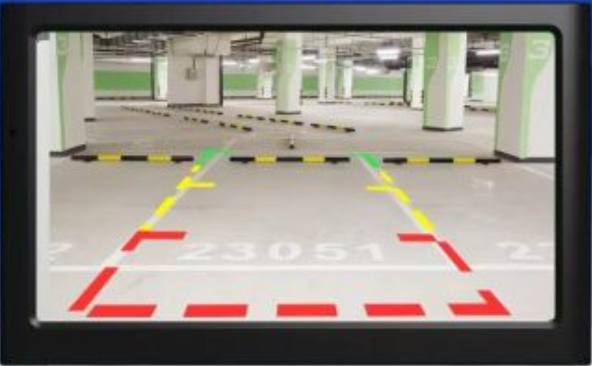

# Trabajando con video y creando ventanas

# Crear ventanas numpy
    import numpy as np

## Capturar video codigo base

    import cv2
    import numpy as np

    webcam = cv2.VideoCapture(0)
        while True:
            ret, frame = webcam.read()
            
            if not ret:
                break   

            cv2.imshow('Webcam', frame)
            if cv2.waitKey(1) & 0xFF == ord('q'):
                break

    webcam.release()
    cv2.destroyAllWindows()

webcam es un objeto que captura la informacion de mi cámara
el Ciclo While permite la captua constante y condicionada de la camara
ret y frame son dos objetos 1 que detecta la activacion de la camara y el otro la captura

    if not ret
es una condicion que finaliza el ciclo cuando la camara no es detectada

    cv2.imshow
nos muesta el contenido capturado en frame

    if cv2.waitKey(1) & 0xFF == ord('q'):
                break
Es una condicion de cierre para el ciclo cuando se precione la techa q minuscula

    webcam.release()
    cv2.destroyAllWindows()
Se ocupan para liberar el buffer de memoria ram de la variable y cerrar la aplicacion

### Complemento
Usamos flip para invertir la camara y que no se vea como espejo
    
    frame = cv2.flip(frame, 1)

# Segunda parte del codigo
Ahora usaremos la libreria numpy para crear una ventana que es un contenedor para interface
    ventana = np.zeros(frame.shape, np.uint8)

El proyecto se trata de colocar 4 capturas de video dentro de la venta

## Explicación
Creada la ventana vamos a tomar el tamaño de la captura de video en 2 variable width y higth
    
    ret, frame = webcam.read()
    width = int(webcam.get(3))
    height = int(webcam.get(4))

Despues vamos a usar ese alto y ancho para determinar los 4 puntos de la ventana 

    ventana = np.zeros(frame.shape, np.uint8)
    #Esta variable redimenciona la imagen al 50% del tamaño original 
    small = cv2.resize(frame, (0, 0), fx=0.5, fy=0.5)
    
    #ventana ocupa en los corchetes 2 parametros el alto y el ancho al dividir el tamañao
    #entre 2 tenemos la mitad del ancho y del alto solo colocamos la posicion y listo
    ventana[:height//2, :width//2] = small #parte superior izquierda
    ventana[:height//2, width//2:] = small #parte superior derecha
    ventana[height//2:, :width//2] = small #parte inferior izquierda
    ventana[height//2:, width//2:] = small #parte inferior derecha

# Segundo proyecto dibujar sobre ventana

    # Dibujar una línea verde en el marco
    # frame es sobre donde estara la imagen
    # primer grupo es donde inicia en x Y y la linea
    # segundo grupo es donde termina la linea en x Y y
    # tercer grupo es el color de la linea en formato BGR (azul, verde, rojo)
    # cuarto grupo es el grosor de la linea
    frame = cv2.line(frame, (width//2, 0), (width//2, height), (0, 255, 0), 4)
    frame = cv2.line(frame, (0, height//2), (width, height//2), (0, 0, 255), 4)

## Resultado

## Reto virtualizar esta imagen
### Crea basado en esta interface el codigo.
